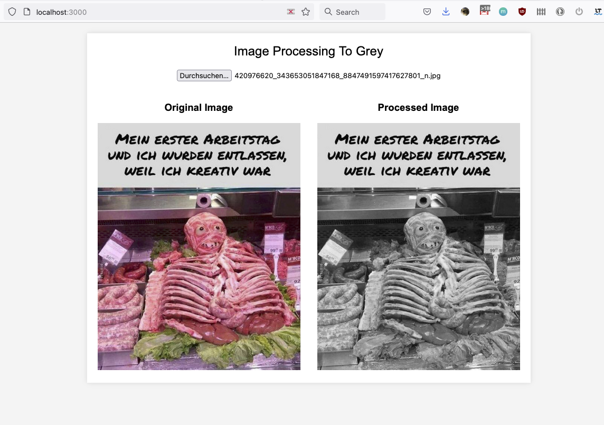

# Grayscale Image Conversion Demo Application

## Idea
The goal is to create a web-based application that allows users to easily upload their color photographs and convert them to grayscale images. The application leverages Node.JS for server-side operations and OpenCV for efficient image processing. A focus has been placed on creating an intuitive and user-friendly interface to facilitate a smooth user experience.

## Key Features
- **User Interface**: A simple and clean web interface for straightforward photo uploads.
- **Image Upload**: Users can upload color photographs in various formats including JPG and PNG.
- **Grayscale Conversion**: Utilizing the power of OpenCV to convert uploaded photographs to grayscale.
- **Image Display**: The processed grayscale images are displayed on the web interface, available for viewing and downloading.
- **Server-Side Processing**: Node.JS is used for all server-side operations, from image upload to processing and final retrieval.

## Performance Criteria
- Grayscale conversion is swift, taking no more than a few seconds for standard-sized images.
- The web interface is responsive and compatible across a range of browsers and devices.

## Technologies Used
- JavaScript
- JQuery
- Node.JS
- C++
- OpenCV

## Demo Screenshot
Below is a screenshot demonstrating the grayscale conversion process:

---
*Please note that the application is a proof of concept done for fun and learning. Further development may be required to enhance functionality and user experience.*
